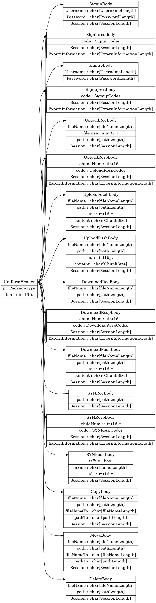

# 网盘功能的设计
<p align='right'><b>1752877 胡轩</b></p>
<p align='right'><b>1752132 王森</b></p>
<p align='right'><b>1752910 张钇文</b></p>

<!-- @import "[TOC]" {cmd="toc" depthFrom=2 depthTo=6 orderedList=false} -->

<!-- code_chunk_output -->

- [网盘功能的设计](#网盘功能的设计)
  - [总体架构图](#总体架构图)
    - [总架构图](#总架构图)
    - [server端和Windows客户端的架构图](#server端和windows客户端的架构图)
  - [数据库设计](#数据库设计)
  - [储存方案设计](#储存方案设计)
  - [用户目录设计](#用户目录设计)
    - [概念](#概念)
    - [设计](#设计)
  - [通讯协议的设计](#通讯协议的设计)
    - [概述](#概述)
    - [设计框图](#设计框图)
      - [类与类间关系](#类与类间关系)
      - [解释说明](#解释说明)
    - [使用方法](#使用方法)
  - [Windows客户端 服务器的设计](#windows客户端-服务器的设计)
    - [控制模块](#控制模块)
    - [receiver 模块](#receiver-模块)
      - [解释说明](#解释说明-1)
    - [sender 模块](#sender-模块)
      - [解释说明](#解释说明-2)
    - [操作数据库模块](#操作数据库模块)
    - [文件读写模块](#文件读写模块)

<!-- /code_chunk_output -->

## 总体架构图

### 总架构图


### server端和Windows客户端的架构图


## 数据库设计

数据库总共有三张表，分别是Users ()用于存储用户信息，Files(用于存储文件信息)和FileIndex(用于存储文件索引)，下面是具体的表结构

|     表名      | 字段名   | 数据类型     | 说明             |
| :-----------: | -------- | ------------ | ---------------- |
|   **Users**   | Uid      | int          | 用户编号         |
|               | Uname    | varchar(32)  | 用户名           |
|               | Password | varchar(32)  | 用户密码         |
|   **Files**   | Uid      | int          | 文件所属用户编号 |
|               | Filename | varchar(64)  | 文件名           |
|               | Size     | int          | 文件大小(Byte)   |
|               | Dir     | varchar(128) | 文件所属文件夹名       |
|               | Hash     | varchar(128) | 文件哈希码       |
|               | Bitmap   | text(65535)  | 文件位示图       |
|               | Modtime  | Datatime     | 文件修改时间     |
|               | Complete  | Tinyint     | 文件是否完整     |
|               | Isdir  | Tinyint     | 该表项是否为文件夹    |
| **FileIndex** | Hash     | varchar(128) | 文件的哈希码     |
|               | Refcount | int          | 文件的引用次数   |
|               |          |              |                  |


其中,文件的位示图用来表示文件的哪些部分已经上传完毕了,一个字节表示1M,其中每一个1M都有三种状态分别是:已上传,未上传和正在上传,由于位示图大小最大未65535字节,所以本系统所能支持的最大单个上传文件的大小为64G.

## 储存方案设计

为了适应断点续传以及多用户共同上传等功能,我们的网盘系统采用了分散式存储的方式

首先,所有的文件都存在一个data文件夹下, 对于每一个文件都会有一个用其哈希码命名的文件夹,里面会按数字从小到大存放文件数据,其中1号文件存放第1M,2号存第2M,以此类推.

文件系统的结构图如下

data
├─hashcode-of-file1
│      1
│      2
│      3
│      4
│      5
│      
├─hashcode-of-file2
│      1
│      2
│      3
│      
├─hashcode-of-file3
└      1
        

## 用户目录设计
### 概念
用户目录就是每个用户在使用网盘的时候看到的文件管理视图。

### 设计
我们采用服务器端如下的方式进行实现：
1. 索引数据库 `表1` 查找到相应的用户的相应的文件编号及其相关路径
2. 将相关的路径存储到相应的传输用的数据包中
3. 通过 `TCP/IP` 协议进行传输相应的数据包
4. 客户端接收到相应的数据包进行解析
5. 显示到客户的GUI界面上

## 通讯协议的设计
### 概述
本次的设计协议主要通过结构体进行 `socket` 上的传输。
结构体主要分为两类。
- 第一类被称为 `UniformHeader`，功能是告知双方要进行的类型操作，并且告知需要读取多少字节的类型。
- 第二类以 `*Body` 的进行命名。主要就是具体的命令的特定的数据成员。因不同的结构体而异。
### 设计框图
#### 类与类间关系


#### 解释说明
本通讯协议由 `Header + Body` 模式进行传送。即每次通过先通过传送统一大小、统一格式内容的 `Header` 来告知接收者接下来要传递的包的种类和长度。然后在读取特定长度的包，进行信息的通知。

上图展示了基本的使用方法和类内关系。
>eg: 如果我们想要发送 `登陆请求`，需要先发送 `UniformHeader`,告知接收方下一个包是 `SigninBody`。

类内的第一行是类（数据包）的名称。接下来的行指向的是数据成员，由 `名称：类型` 组成。
> eg: SigninBody这个数据包由以下三个数据成员： 
> - Username 用户名 `char[]`
> - Password 密码 `char[]`
> - Session 建立的会话 `char[]`

### 使用方法

根据使用场景不同，将使用场景分为以下几种。
- 登录用户
> 1. `UniformHeader` + `SigninBody`    `C->S`
> 2. `UniformHeader` + `SigninresBody` `S->C`


- 注册用户
> 1. `UniformHeader` + `SignupBody` `C->S`
> 2. `UniformHeader` + `SignupresBody` `S->C`		

- 上传数据
> 1. `UniformHeader` + `UploadReqBody` `C->S`
> 2. `UniformHeader` + `UploadRespBody` `S->C`
> 3. `UniformHeader` + `UploadFetchBody` `S->C`
> 4. `UniformHeader` + `UploadPushBody` `C->S`

- 下载数据
> 1. `UniformHeader` + `DownloadReqBody` `C->S`
> 2. `UniformHeader` + `DownloadRespBody` `S->C`
> 3. `UniformHeader` + `DownloadPushBody` `S->C`

- 显示文件夹内容
> 1. `UniformHeader` + `SYNReqBody` `C->S`
> 2. `UniformHeader` + `SYNRespBody` `S->C`
> 3. `UniformHeader` + `SYNPushBody` `S->C`

## `Windows客户端` 服务器的设计
### 控制模块
控制模块负责监听端口并与客户端建立连接。控制模块接收client发来的所有“命令”，如注册、登录、同步用户目录、修改目录、上传和下载等。其中，注册、登录、同步用户目录和修改目录四个命令，由控制模块联合数据库访问模块完成。控制模块收到上传命令并解析完毕后，将具体的文件名、用户等信息交给上传模块，具体上传任务由receiver模块配合数据库模块、文件读写模块完成。控制模块收到下载命令并解析完毕后，将具体的文件名、用户等信息交给下载模块，具体下载任务由sender模块配合数据库模块、文件读写模块完成。

### receiver 模块
receiver模块负责与客户端的sender模块通过TCP连接交互，完成上传任务。
receiver模块的工作流程如图所示：

#### 解释说明
从控制模块收到用户id和文件信息后，receiver模块维护一个“文件-socket”表，将正在上传该文件的用户socket放一个集合中。receiver模块使用文件hash查询文件信息，查询结果分为3类。若文件存在且完整，就完成上传，即“秒传”。若文件不存在则在数据库Files表中新增文件信息。若文件存在但不完整，则取标记文件块的位示图，从中选取未上传的文件块，并指派一个空闲的socket发送取该文件块的请求，然后开始接收文件上传。接收的同时将文件发送给文件读写模块写入磁盘。若接收了完整的一块文件，则更新位示图。
文件名和存储位置映射关系的建立过程，完成上传后修改“文件-socket”表的过程，和文件读写模块交互的详细过程未在图中展示。

### sender 模块
sender模块负责与客户端的receiver模块通过TCP连接交互，完成下载任务。


#### 解释说明

从控制模块收到用户id和文件信息后，sender模块维护一个“socket-文件”表，表中建立socket和文件的单一映射关系，即每个socket对应一个文件，直到完成下载。客户端的receiver模块维护服务端receiver模块的位示图结构，当socket空闲时向服务端sender模块发送指定的接收块号。sender模块访问数据库获得文件标识，结合客户端发来的指定块号向文件读写模块发送读取请求。sender模块读到文件内容的同时向该客户端发送文件数据。

### 操作数据库模块

该模块主要功能是读写数据库,此模块对外使用管道与其他进程通信,在其内部维护一个数据库操作事件队列,一旦其他进程有新的操作数据库命令到达,将对应的事件插入到队列尾部,每次执行队列最前端的操作,直到整个队列为空. 该模块具体的伪代码实现如下

```c
//连接数据库
init_mysql()
//创建数据库事件队列
init_mysql_event_queue();
//初始化输入管道
init_input_fifo()
//初始化输出管道
init_output_fifo()
//为输入管道创建对应的epoll事件
create_epoll_event();
while(1)
{
	//监听其他进程向其发送命令的管道(阻塞)
	count = epoll_wait(fifos);   
    for(i=0;i<count;i++)
    {	
    	//若该管道有命令写入
        if(fifos[i]==input)
        {	
        	//读出相应的命令
        	read(cmd,sizeof(cmd));
        	//将其插入事件队列的队尾
        	event_queue.push(cmd);
        }
    }
    //若事件队列不为空
    if(!event_queue.empty())
    {
    	//取出事件队列的第一个元素
    	 event_queue.pop(cmd);
    	 //执行对应的操作数据库命令
    	 result = do_cmd(cmd);
    	 //将命令执行结果传回相应的模块
    	 send(result,fifo);
    }
}
```


### 文件读写模块

本模块的主要功能为读写所需文件,对外它通过管道和其他的模块进行通信,.  考虑到读写可以并行,所有又将这个模块划分为了读模块和写模块.下面是详细的设计

* 读命令所用结构体

```c
struct FileReadCmd{
	//文件哈希码,大小和数据库中对应
    char hash[128];
    //文件序号,表示读第几M
    int seq;
};
```

* 读模块

```c
//初始化输入管道
init_input_fifo();
//初始化输出管道
init_output_fifo();
//建立epoll事件
init_epoll();
while(1)
{
    //等待读命令到达
    count = epoll_wait(events,NULL);
    //从输入管道中读取命令
    recv(input_fifo,cmd)；
    //根据命令取出需要的数据
    data = read_from_file(cmd);
    //将数据发送给其他模块    
    send(output_fifo,data);
}
```

* 写命令所用结构体(命令后面跟文件数据)

```c
struct FileWriteCmd{
	//文件哈希码,大小和数据库中对应
    char hash[128];
    //文件序号,表示写第几M
    int seq;
    //文件数据长度
    int length;
};
```

* 写模块

```c
//初始化输入管道
init_input_fifo();
//初始化输出管道
init_output_fifo();
//建立epoll事件
init_epoll();
while(1)
{
    //等待写命令到达
    epoll_wait(events,NULL);
    //读数据，上次可能还有残留数据，从后续位置开始读
    len = recv(input_fifo,buf+buf_len,BUF_SIZE-buf_len,0)；
    if(len<=0)
    {
        //错误处理
    }
    //更新读到的数据长度
    buf_len += len;
    bool hasCmd = false;
    FileWriteCmd  cmd;
    char *p = buf;
    //处理缓冲区
    while(buf_len >= sizeof(FileWriteCmd))
    {
        //还没有读到过命令且缓冲区中数据不到一个命令长度，退出
    	if(buf_len < sizeof(FileWriteCmd) && !hasCmd)
            break;
        //若没有读到过命令且缓冲区中数据大于一个包长
       	else if(buf_len < sizeof(FileWriteCmd))
        {
            hasCmd = 1;
            //取得cmd
            cmd = *(FileWriteCmd*)p;
        }
        //若读到了命令且数据大于等于一个包长，则将其写成文件，并将hasCmd置false
        if(hasCmd && buf_len>=cmd.length)
        {
            hasCmd = 0;
            //写文件
            write_to_file(p+sizeof(FileWriteCmd),cmd);
            //更新指针位置
            p += sizeof(FileWriteCmd)+cmd.lenrth;
            //更新缓冲区读入数据大小
            buf_len -= sizeof(FileWriteCmd)+cmd.lenrth;
        }   
    }   
    //若还有剩余数据，则移动到前面
    if(buf_len>0)
    {
        memmove(buf,p,buf_len);
    }
}
```
